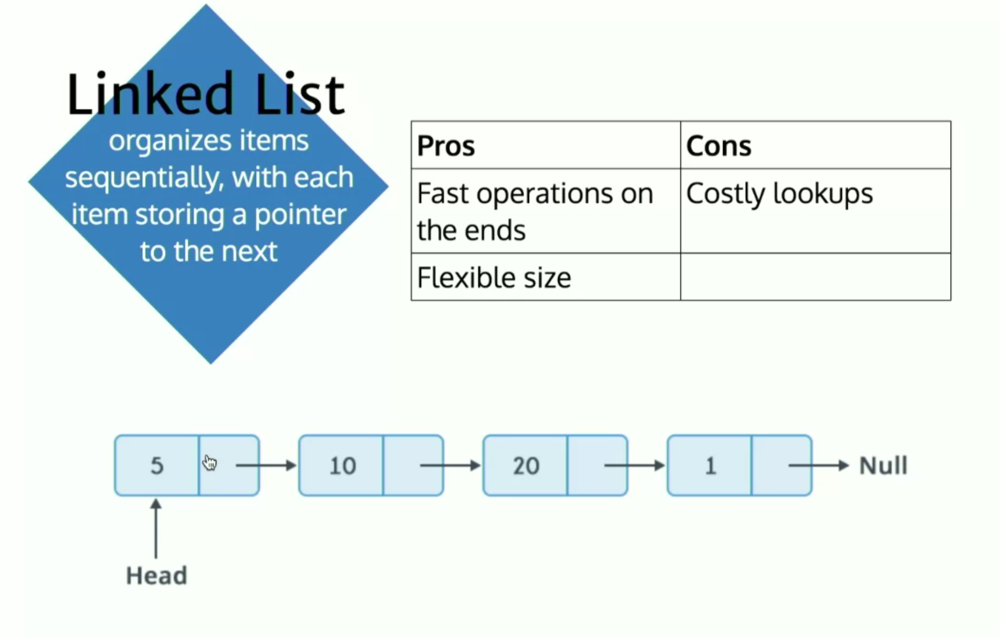

# Linked List
It organizes items sequentially with each item storing the pointer to the next item. This is the underlying data structure for the stack and queue implementation.

Example Of Single Linked list:
```js
const linkedList = {
  value: "One",
  next: {
    value: "Two",
    next: {
      value: "Three",
      next: {
        value: "Four",
        next: null
      }
    }
  }
}
```



## Play With
[Visual](https://visualgo.net/en/list)